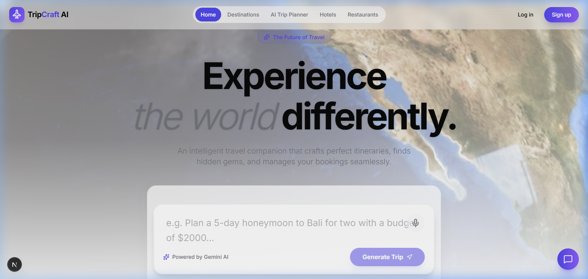
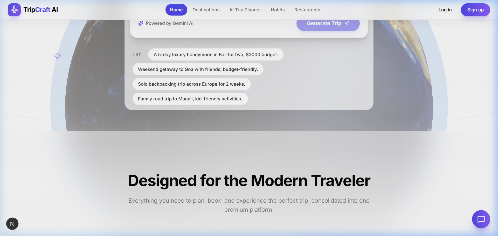
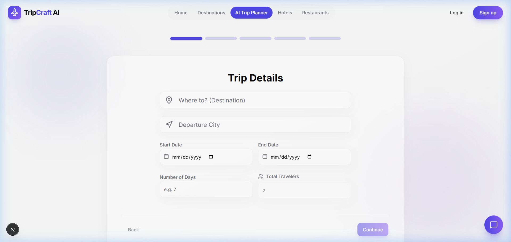
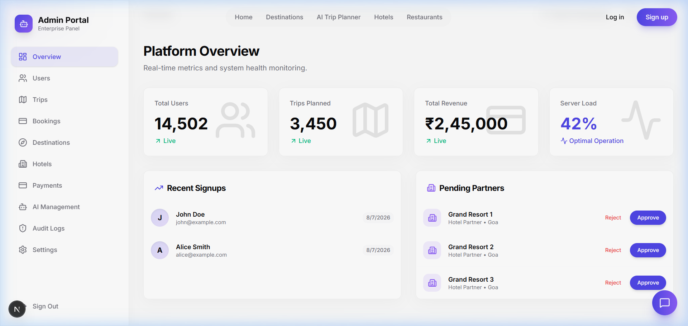
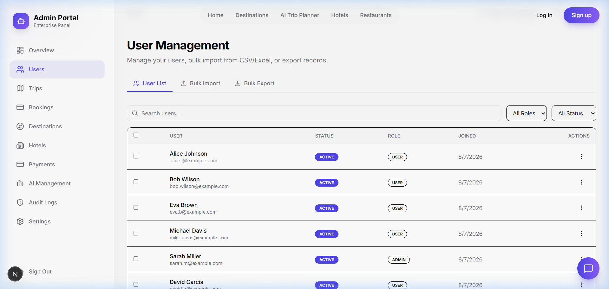
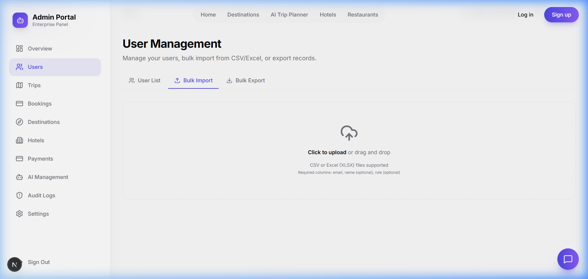

<p align="center">
  
</p>

<h1 align="center">AI Trip Planner 🌍✈️</h1>

<p align="center">
  <strong>Your intelligent, AI-powered travel companion — plan smarter, travel better.</strong>
</p>

<p align="center">
  <a href="https://nextjs.org"></a>
  <a href="https://react.dev"></a>
  <a href="https://www.typescriptlang.org"></a>
  <a href="https://tailwindcss.com"></a>
  <a href="https://orm.drizzle.team"></a>
  <a href="https://clerk.com"></a>
  <a href="https://stripe.com"></a>
  <a href="https://ai.google.dev"></a>
</p>

<p align="center">
  <a href="#-features">Features</a> •
  <a href="#-screenshots">Screenshots</a> •
  <a href="#%EF%B8%8F-architecture">Architecture</a> •
  <a href="#-getting-started">Getting Started</a> •
  <a href="#-environment-variables">Environment Variables</a> •
  <a href="#-docker">Docker</a> •
  <a href="#-contributing">Contributing</a>
</p>

---

## 📋 Overview

AI Trip Planner is a **full-stack travel companion** that eliminates the chaos of trip planning. Powered by **Google Gemini AI**, it generates personalized day-by-day itineraries, tracks expenses, manages bookings, enables real-time collaboration, and delivers everything through a stunning, modern interface with 3D globe visualizations, glassmorphism design, and smooth animations.

> **Problem:** Planning a trip means juggling dozens of tabs for flights, hotels, itineraries, budgets, and maps — with no single platform that ties it all together intelligently.
>
> **Solution:** AI Trip Planner consolidates everything into one AI-driven platform that understands your preferences, budget, and travel style to generate complete, actionable travel plans in seconds.

---

## ✨ Features

### 🤖 AI-Powered Planning
- **Smart Itinerary Generation** — Day-by-day travel plans built from your preferences, budget, and travel style using Google Gemini AI
- **Modular AI Pipeline** — Specialized modules for itinerary scheduling, budget estimation, and hidden gem recommendations
- **Structured Output** — Strict JSON schema enforcement with fallback parsing and retry mechanisms for reliable AI responses

### 🗺️ Trip Management
- **Multi-Destination Routing** — Plan complex multi-city trips with optimized routes and inter-city transport suggestions
- **Drag & Drop Itineraries** — Reorder activities with `@dnd-kit` and lock preferred items in place
- **Interactive Maps** — Visualize your journey with Leaflet and Google Maps integration
- **3D Globe Exploration** — Explore destinations on an interactive 3D globe with `react-globe.gl` and `COBE`

### 👥 Collaboration
- **Real-Time Co-Planning** — Plan trips with friends using live cursors and synchronized editing via Socket.io WebSockets
- **Role-Based Access** — Owner, Editor, and Viewer roles per trip for fine-grained collaboration control
- **Optimistic UI Updates** — Instant local feedback with background sync and conflict resolution via Zustand

### 💰 Budgeting & Expenses
- **Multi-Currency Support** — Toggle between global currencies with live exchange rate data
- **Smart Expense Tracking** — Log and categorize trip expenses (flights, food, activities, accommodations)
- **Budget Analytics** — Visual dashboards with Recharts showing spending vs. budget breakdowns
- **AI Financial Tips** — Localized cost-saving recommendations from the AI engine

### 🏨 Bookings & Search
- **Flight Search** — Compare flight options with real-time pricing
- **Hotel Search** — Browse and compare hotel accommodations
- **Restaurant Recommendations** — AI-curated dining suggestions based on dietary preferences and cuisine interests
- **Things To Do** — Discover activities, attractions, and experiences at your destination

### 📱 Progressive Web App
- **Installable PWA** — Add to home screen on mobile or desktop with offline access to saved itineraries
- **Service Worker Caching** — Offline-first architecture with Workbox for reliable performance
- **Push-Ready** — Infrastructure ready for push notifications

### 📊 Dashboard & Analytics
- **User Dashboard** — Overview of upcoming trips, countries visited, expense snapshots, and saved places wishlist
- **Travel Journal** — AI-assisted photo journal and scrapbook for trip memories
- **Community Hub** — Discover and share public trip templates with other travelers

### 🛡️ Admin Panel
- **User Management** — Real-time search, pagination, role/status filters with detailed profile modals
- **Bulk Import/Export** — Drag-and-drop CSV/Excel upload with client-side validation and batch database inserts
- **Export Formats** — Filter and download user data as CSV, Excel, or PDF
- **Audit Logs** — Immutable log of all admin actions for security and compliance
- **Booking & Trip Management** — Admin-level views of all bookings and trips across the platform

### 💳 Monetization
- **Stripe Integration** — Subscription billing with Free, Pro, and Premium tiers
- **Trip Credits System** — Users start with 3 free trip credits; upgrade for unlimited access
- **Webhook-Driven** — Stripe and Clerk webhooks for real-time event processing

---

## 📸 Screenshots

<table>
  <tr>
    <td align="center"><strong>🏠 Landing Page — Hero</strong></td>
    <td align="center"><strong>✨ Features Section</strong></td>
  </tr>
  <tr>
    <td></td>
    <td></td>
  </tr>
  <tr>
    <td align="center"><strong>📝 Trip Planner Form</strong></td>
    <td align="center"><strong>🔧 Admin Dashboard</strong></td>
  </tr>
  <tr>
    <td></td>
    <td></td>
  </tr>
  <tr>
    <td align="center"><strong>👥 User Management</strong></td>
    <td align="center"><strong>📤 Bulk Import</strong></td>
  </tr>
  <tr>
    <td></td>
    <td></td>
  </tr>
</table>

---

## 🏗️ Architecture

```
┌──────────────────────────────────────────────────────────────────────┐
│                        CLIENT LAYER                                  │
│  Next.js 16 (React 19) • Tailwind CSS • Framer Motion • Zustand     │
│  Leaflet Maps • 3D Globe (react-globe.gl / COBE / Three.js)         │
└──────────────────────────┬───────────────────────────────────────────┘
                           │
                           ▼
┌──────────────────────────────────────────────────────────────────────┐
│                        API LAYER                                     │
│  Next.js API Routes (App Router) • Server Actions                    │
│  Clerk Middleware (Auth) • Stripe Webhooks • Rate Limiting (Upstash) │
└──────────┬───────────────┬───────────────┬──────────────────────────┘
           │               │               │
           ▼               ▼               ▼
┌────────────────┐ ┌──────────────┐ ┌──────────────────────┐
│   AI LAYER     │ │  DATA LAYER  │ │  REAL-TIME LAYER     │
│                │ │              │ │                      │
│ Google Gemini  │ │ PostgreSQL   │ │ Socket.io Server     │
│ AI SDK         │ │ (Supabase)   │ │ Redis Adapter        │
│ Modular        │ │ Drizzle ORM  │ │ Live Cursors         │
│ Pipeline       │ │ pgvector     │ │ Collaborative Edit   │
└────────────────┘ └──────────────┘ └──────────────────────┘
                           │
                           ▼
┌──────────────────────────────────────────────────────────────────────┐
│                     EXTERNAL SERVICES                                │
│  Clerk (Auth) • Stripe (Payments) • Resend (Email) • PostHog        │
│  Sentry (Monitoring) • Upstash Redis (Rate Limiting & Caching)       │
│  Google Maps/Places API • Inngest (Background Jobs)                  │
└──────────────────────────────────────────────────────────────────────┘
```

### Database Schema Overview

| Table | Purpose |
|-------|---------|
| `User` | Users with roles, subscription status, Stripe IDs, preference profiles |
| `Trip` | Trip metadata — origin, destination, budget, dates, travel style, pace |
| `TripDestination` | Multi-destination support with ordering, lat/lng, transport between stops |
| `TripDay` | Individual days within a trip linked to destinations |
| `Activity` | Scheduled activities with time, cost, category, map coordinates, hidden gems |
| `TripCollaborator` | Collaborator assignments with role-based permissions |
| `Expense` | Expense tracking by category with multi-currency support |
| `Booking` | Booking records (hotels, flights, activities) with status tracking |
| `Place` | Saved/wishlist places with ratings and visit tracking |
| `AuditLog` | Immutable admin action logs for compliance |
| `Notification` | User notification system |
| `CommunityReview` | Public trip reviews and ratings |

---

## 🛠️ Tech Stack

| Category | Technologies |
|----------|-------------|
| **Framework** | Next.js 16.3 (App Router, Turbopack) |
| **Frontend** | React 19, TypeScript 5, Tailwind CSS 4, Framer Motion |
| **UI Components** | Radix UI, Shadcn/ui, Lucide Icons |
| **3D / Visualization** | Three.js, React Three Fiber, React Three Drei, COBE, react-globe.gl |
| **Maps** | Leaflet, React Leaflet, Google Maps (`@react-google-maps/api`), Mapbox GL |
| **State Management** | Zustand |
| **Data Fetching** | TanStack React Query |
| **Forms** | React Hook Form |
| **Database** | PostgreSQL (Supabase), Drizzle ORM, pgvector |
| **Authentication** | Clerk |
| **Payments** | Stripe |
| **AI** | Google Gemini (via AI SDK + `@google/generative-ai`) |
| **Real-Time** | Socket.io, Upstash Redis Adapter |
| **Email** | Resend, React Email |
| **Background Jobs** | Inngest |
| **Analytics** | PostHog |
| **Monitoring** | Sentry |
| **Rate Limiting** | Upstash Redis |
| **File Processing** | PapaParse (CSV), SheetJS/xlsx (Excel), jsPDF (PDF), html2canvas |
| **Charts** | Recharts |
| **Testing** | Jest, Playwright, Testing Library |
| **Deployment** | Docker, Vercel |

---

## 🚀 Getting Started

### Prerequisites

- **Node.js** 20+
- **npm** 10+
- **PostgreSQL** database (or [Supabase](https://supabase.com) account)

### Installation

1. **Clone the repository**
   ```bash
   git clone https://github.com/rudrarao-maker/AI-TripPlanner.git
   cd AI-TripPlanner
   ```

2. **Install dependencies**
   ```bash
   npm install
   ```

3. **Set up environment variables**

   Create a `.env.local` file in the root directory (see [Environment Variables](#-environment-variables) below).

4. **Push the database schema**
   ```bash
   npm run db:push
   ```

5. **Start the development server**
   ```bash
   npm run dev
   ```

6. **Open in browser**

   Navigate to [http://localhost:3000](http://localhost:3000)

### Optional: Start the WebSocket server (for real-time collaboration)
```bash
npm run socket
```

---

## 🔐 Environment Variables

Create a `.env.local` file in the project root with the following variables:

| Variable | Description |
|----------|-------------|
| `DATABASE_URL` | PostgreSQL connection string |
| `NEXT_PUBLIC_SUPABASE_URL` | Supabase project URL |
| `NEXT_PUBLIC_SUPABASE_ANON_KEY` | Supabase anonymous key |
| `GEMINI_API_KEY` | Google Gemini API key |
| `GOOGLE_GENERATIVE_AI_API_KEY` | Google AI SDK key |
| `GEMINI_MODEL` | Gemini model name (e.g., `gemini-3.5-flash`) |
| `NEXT_PUBLIC_CLERK_PUBLISHABLE_KEY` | Clerk publishable key |
| `CLERK_SECRET_KEY` | Clerk secret key |
| `CLERK_WEBHOOK_SECRET` | Clerk webhook signing secret |
| `STRIPE_SECRET_KEY` | Stripe secret API key |
| `STRIPE_WEBHOOK_SECRET` | Stripe webhook signing secret |
| `NEXT_PUBLIC_GOOGLE_MAPS_API_KEY` | Google Maps JavaScript API key |
| `GOOGLE_PLACES_API_KEY` | Google Places API key |
| `NEXT_PUBLIC_POSTHOG_KEY` | PostHog project API key |
| `NEXT_PUBLIC_POSTHOG_HOST` | PostHog host URL |
| `UPSTASH_REDIS_REST_URL` | Upstash Redis REST URL |
| `UPSTASH_REDIS_REST_TOKEN` | Upstash Redis REST token |
| `RESEND_API_KEY` | Resend email API key |
| `SENTRY_AUTH_TOKEN` | Sentry authentication token |

---

## 📜 Available Scripts

| Command | Description |
|---------|-------------|
| `npm run dev` | Start development server (Turbopack) |
| `npm run build` | Create production build |
| `npm start` | Start production server |
| `npm run lint` | Run ESLint |
| `npm run db:generate` | Generate Drizzle migrations |
| `npm run db:push` | Push schema to database |
| `npm run db:studio` | Open Drizzle Studio (database GUI) |
| `npm run socket` | Start WebSocket server for collaboration |
| `npm test` | Run Jest unit tests |
| `npm run test:e2e` | Run Playwright end-to-end tests |
| `npm run test:e2e:ui` | Run Playwright tests with UI mode |

---

## 🐳 Docker

### Build the image
```bash
docker build -t ai-trip-planner .
```

### Run the container
```bash
docker run -p 3000:3000 --env-file .env.local ai-trip-planner
```

The application will be available at [http://localhost:3000](http://localhost:3000).

---

## 📁 Project Structure

```
AI-TripPlanner/
├── src/
│   ├── app/                    # Next.js App Router pages & API routes
│   │   ├── (auth)/             # Authentication pages (sign-in/sign-up)
│   │   ├── admin/              # Admin panel (users, bookings, trips, settings)
│   │   ├── api/                # API routes (ai, flights, bookings, webhooks, etc.)
│   │   ├── dashboard/          # User dashboard
│   │   ├── trip-planner/       # AI trip planning form
│   │   ├── destinations/       # Destination explorer
│   │   ├── expense-tracker/    # Expense management
│   │   ├── travel-journal/     # Photo journal & scrapbook
│   │   ├── community/          # Community trip sharing
│   │   ├── pricing/            # Subscription plans
│   │   └── ...                 # Additional pages
│   ├── components/             # Reusable UI components
│   │   ├── admin/              # Admin-specific components
│   │   ├── ai/                 # AI chat & generation UI
│   │   ├── booking/            # Booking components
│   │   ├── budget/             # Budget & currency components
│   │   ├── dashboard/          # Dashboard widgets
│   │   ├── home/               # Landing page sections (Hero, Features, FAQ, etc.)
│   │   ├── itinerary/          # Itinerary timeline & editor
│   │   ├── map/                # Map components (Leaflet, Google Maps)
│   │   ├── trip-planner/       # Trip creation form components
│   │   ├── ui/                 # Base UI primitives (Button, Card, Globe, etc.)
│   │   └── ...                 # Weather, packing, recommendations, etc.
│   ├── db/                     # Database schema & connection (Drizzle ORM)
│   ├── hooks/                  # Custom React hooks
│   ├── lib/                    # Utility functions & constants
│   ├── providers/              # React context providers
│   ├── store/                  # Zustand stores
│   └── types/                  # TypeScript type definitions
├── drizzle/                    # Database migrations
├── public/                     # Static assets (icons, manifests, textures)
├── tests/                      # E2E tests (Playwright)
├── socket-server.js            # WebSocket server for real-time collaboration
├── Dockerfile                  # Multi-stage Docker build
└── package.json
```

---

## 📖 Developer Guide

### Adding AI Features
- AI prompts are modularized in the API routes under `src/app/api/ai/`
- All new prompts must enforce strict JSON output matching TypeScript interfaces
- Use the AI SDK's structured output capabilities for schema validation

### Database Changes
```bash
# 1. Modify src/db/schema.ts
# 2. Generate migration
npm run db:generate
# 3. Push to database
npm run db:push
```

### UI Components
- Built on Radix/Shadcn primitives — follow existing patterns in `src/components/ui/`
- Use Framer Motion for animations — keep them performant with `useMemo` and `useCallback`
- Heavy components (maps, 3D globes) should be lazy-loaded with `next/dynamic`

### Real-Time Features
- Emit events from the client and handle in `socket-server.js`
- Events are scoped to trip-specific rooms for isolation
- Use Zustand for optimistic UI updates with WebSocket sync

---

## 🤝 Contributing

Contributions, issues, and feature requests are welcome! Feel free to check the [issues page](https://github.com/rudrarao-maker/AI-TripPlanner/issues).

1. Fork the repository
2. Create your feature branch (`git checkout -b feature/amazing-feature`)
3. Commit your changes (`git commit -m 'feat: add amazing feature'`)
4. Push to the branch (`git push origin feature/amazing-feature`)
5. Open a Pull Request

---

## 📄 License

This project is open source and available under the [MIT License](LICENSE).

---

<p align="center">
  Built with ❤️ by <a href="https://github.com/rudrarao-maker">Rudra Rao</a>
</p>
